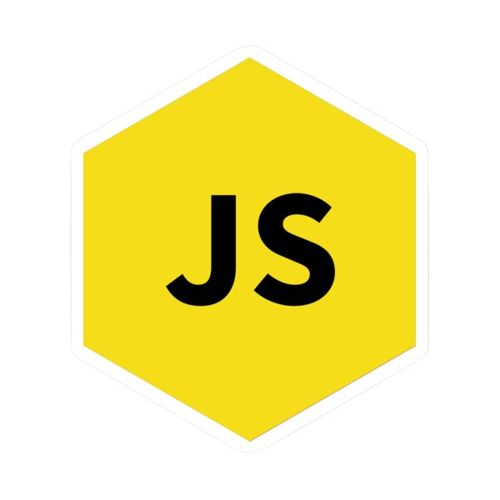

## Hello 👋, I'm Oriol!
#### Backend Developer / Software Engineering Student from Mexico

 
- 📖 I'm currently learning Java with Spring Boot
   
- 😁Excelling at self-taught learning
   
- 💻 I love writing code and learn anything about it
   
- 💬 Text me <a href="https://t.me/OrionC74" title="gmail">Here</a> 
   

 

  
  
     
  

  <code></code>
  <code></code>
  <code></code>
  <code></code>
<code></code>
<code></code>
<code></code>
<code></code>
  <code></code>
<code></code>
  <code></code>
  <code></code>
  <code></code>
  
  

 
Thanks for reading...